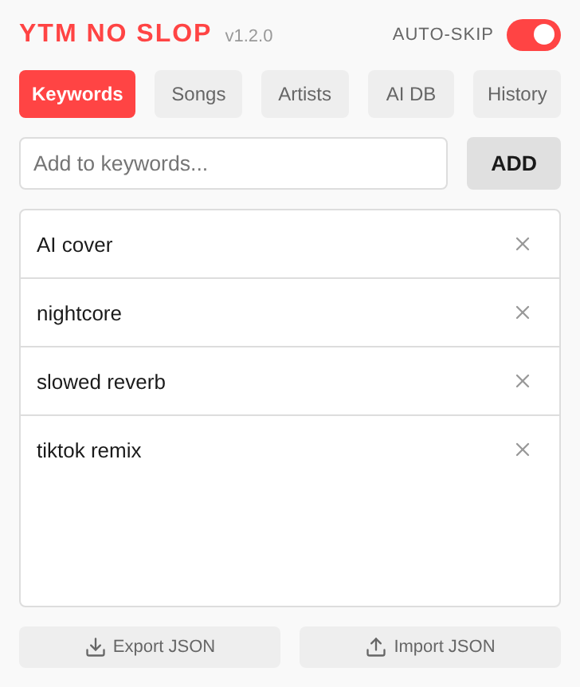
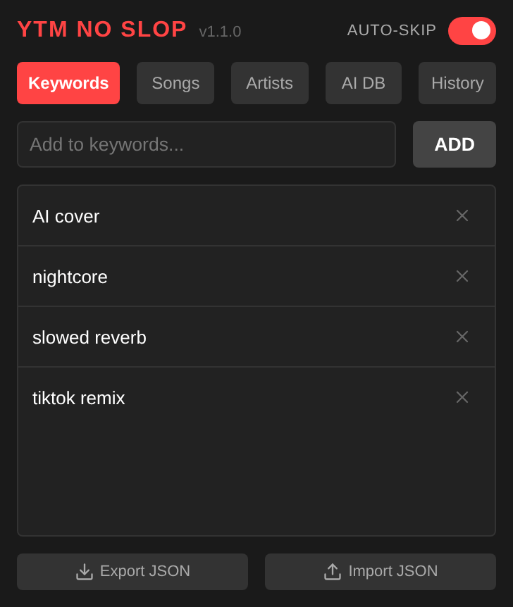

# YTM No Slop

An open-source extension (Chrome, Firefox) for YouTube Music that blocks AI slop artists, songs or keywords.

This extension works locally, with the exception of regularly downloading a database of AI slop artists, per [Acknowledgements](#acknowledgements).

|                                        |                                      |
| -------------------------------------- | ------------------------------------ |
|  |  |

## Build Setup

This project uses **Nix** for the development environment and **WXT** for the extension framework.

```shell
$ nix develop
% yarn install
% yarn dev:chrome
% yarn dev:firefox
```

## Acknowledgements

The database of AI slop artists is a crowd-sourced effort by the community, called [_Soul Over AI_](https://souloverai.com), licensed under the [CC BY 4.0](https://creativecommons.org/licenses/by/4.0/). This extension uses this database, in addition to manually added entries.

## License

This project is licensed under the [MIT License](LICENSE).
